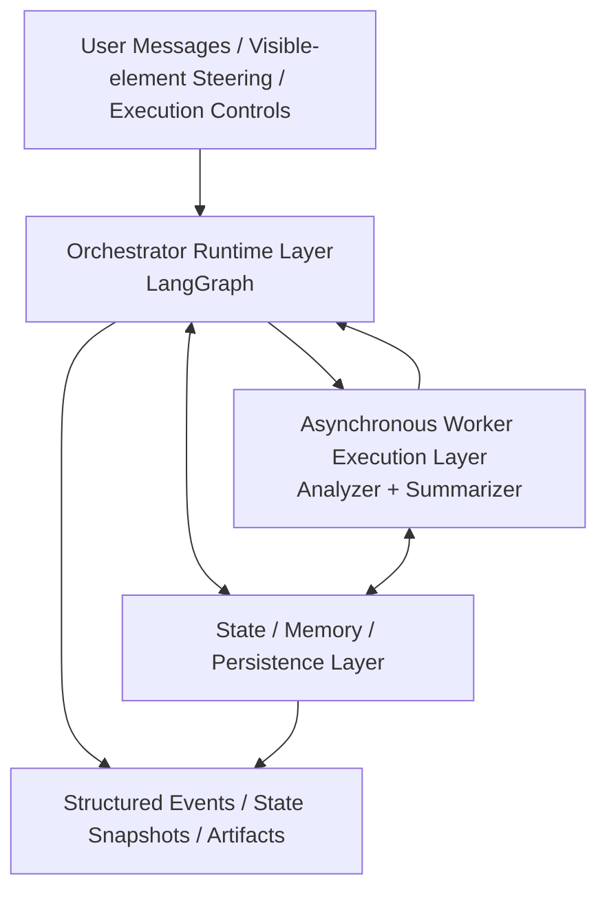
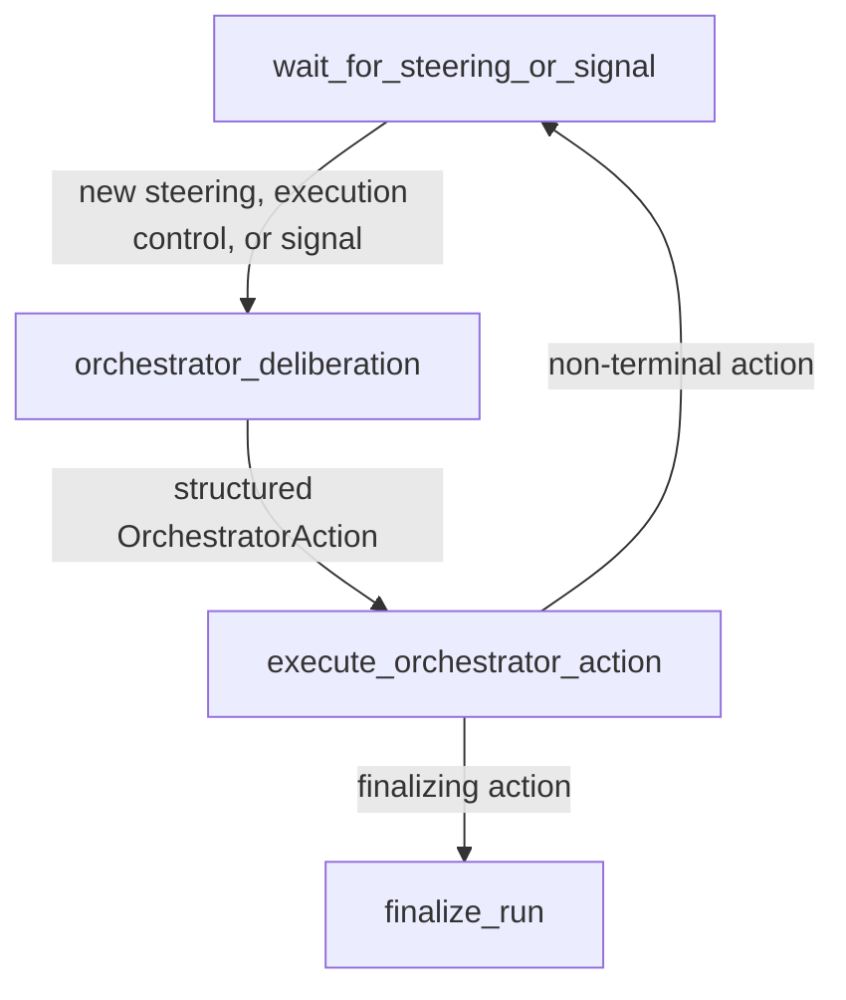

# AdaLens Autonomous Agentic Framework Implementation Supplement

## 1. Overview

This document explains the core agentic runtime of AdaLens.

The supplement keeps four elements in view:

- the `LangGraph + LangChain` execution backbone
- the three-agent design of `Orchestrator`, `Analyzer`, and `Summarizer`
- core framework code paths
- the core runtime contracts that connect steering, signals, plan-thread execution, findings, and persistence

### 1.1 Core Assumptions

- The paper-level semantics include `run`, `turn`, `plan thread`, `summary`, `atomic insight`, `data column`, `steering`, and storyline-based oversight.
- The framework is organized as an `orchestrator--worker` runtime: the orchestrator makes high-level decisions, while workers execute local analysis.
- User steering is a first-class runtime input rather than a lightweight UI hint.
- The system must support long-running analysis, incremental findings, interruption, and later recovery.


### 1.2 Design Orientation

- **Autonomous high-level control.** The orchestrator decides when to plan, dispatch, synthesize, explain, wait, or finish.
- **Minimal runtime guarantees.** The runtime protects state consistency, tool boundaries, control synchronization, persistence, and resumability.
- **Structured evidence flow.** Worker analysis is only useful when it returns findings that can be bound to columns, artifacts, and later steering.

## 2. Architecture

The core framework is easiest to understand as a signal-aware control loop. The main runtime graph stays in a long-lived listening mode, wakes up when new steering, execution controls, or internal runtime signals arrive, lets the orchestrator decide the next high-level action, executes that action, and then returns to listening unless the run is ready to finish.

### 2.1 Layered View

| Layer                                | Responsibility                                               |
| ------------------------------------ | ------------------------------------------------------------ |
| `Interactive Steering Layer`         | receives user messages, visible-element steering, and execution controls; turns them into runtime steering, control, and wake-up inputs |
| `Orchestrator Runtime Layer`         | hosts the main `LangGraph` and the orchestrator agent; maintains the global control loop |
| `Worker Execution Layer`             | runs asynchronous local analysis through an `Analyzer + Summarizer` backend |
| `State / Memory / Persistence Layer` | records plan lifecycle, steering/control history, findings, artifacts, timeline, and wake-up context |



### 2.2 Main Runtime Loop

The main graph expresses only the global control loop. It does not inline the worker execution path.



`wait_for_steering_or_signal` is the single listening entry point of the runtime. It absorbs the lower-level duties that would otherwise be spread across separate ingestion, registration, and state-refresh nodes:

- listen for new steering from the user
- register execution controls from user-facing plan operations
- listen for internal runtime signals
- refresh or resume the latest `RunState`
- materialize pending runtime updates into persisted state before the next orchestrator round
- prepare normalized context for the next orchestrator round

`wait_for_steering_or_signal` is the unified listening state of the runtime. Execution controls enter through the same wake-up boundary while remaining distinct from intention-level steering in the runtime contracts.

The three wake-up classes are:

- `steering`: user-authored directional guidance such as chat follow-ups, `focus`, `ignore`, and `elaborate`
- `execution control`: plan-thread controls such as `launch`, `pause`, `terminate`, `modify`, and `create`
- `signal`: internal runtime events such as `worker_finding_ready`, `worker_status_updated`, `dispatch_ready`, `post_stage_summary_review_ready`, and other wake-up conditions that justify another orchestrator round

### 2.3 LangGraph and LangChain Responsibilities

| Component        | Core Responsibility                                          |
| ---------------- | ------------------------------------------------------------ |
| `LangGraph`      | long-running state-graph execution, signal-aware waiting, conditional routing, interruption, and recovery |
| `LangChain`      | prompt organization, structured output, tool binding, and runtime wrappers around the three agents |
| Combined Runtime | planning, dispatch, progress evaluation, stage synthesis, and final reporting, all grounded in structured findings written back into state |

### 2.4 Runtime Characteristics

- The framework remains interactive while analysis is running; `wait_for_steering_or_signal` is the persistent listening state rather than a dead end.
- `focus`, `ignore`, and `elaborate` affect the orchestrator's next analytical step rather than directly rewriting an already running worker objective.
- `create_plans` and `dispatch_plans` are asynchronous submission actions: they update runtime state, may emit internal scheduling signals such as `dispatch_ready`, and then return the main graph to listening mode.
- Worker findings and completion events do not appear as dedicated main-graph nodes; they re-enter the global loop as signals and are materialized into persisted run state before the next orchestrator round.

## 3. Core Agent Design

The core design is centered on three agents with different scopes. The orchestrator owns global control. The analyzer owns one local plan thread. The summarizer turns one completed local analysis into a structured finding hierarchy that can re-enter global orchestration.

### 3.1 Orchestrator Agent

| Item           | Description                                                  |
| -------------- | ------------------------------------------------------------ |
| Role           | global strategy controller for a long-running run            |
| Reads          | refreshed `RunState`, `SteeringState`, `ExecutionControlState`, active plans, latest findings, worker availability, and the latest user-authored goal |
| Emits          | structured `OrchestratorAction`                              |
| Main decisions | whether to create plans, dispatch work, evaluate progress, synthesize, explain, wait, or finish |
| Scope          | global only; it does not perform local data analysis itself  |

The orchestrator is the only high-level decision-maker. Its job is not to execute analysis directly but to maintain the overall analytical direction of the run. It determines whether the current goal is sufficiently covered, whether open steering still requires follow-up, whether thread lifecycle needs intervention, and whether the current evidence window is already strong enough for a stage synthesis or a final report.

### 3.2 Analyzer Agent

| Item          | Description                                                  |
| ------------- | ------------------------------------------------------------ |
| Role          | local analyst for one `plan thread`                          |
| Reads         | `PlanState`, runtime execution context, dataset schema, selected artifacts, prior findings, recovery/checkpoint context |
| Emits         | a stream of local execution records through tool calls       |
| Main behavior | ReAct-style loop over reflection, code execution, and evidence inspection |
| Scope         | one plan at a time; it does not manage global run state      |

The analyzer is intentionally narrow in scope. It must answer one plan as fully as practical, using repeated evidence-producing steps rather than one-shot completion. Its local loop is useful only if later summarization can still bind each stable conclusion to concrete code, stdout, and plot evidence.

### 3.3 Summarizer Agent

| Item          | Description                                                  |
| ------------- | ------------------------------------------------------------ |
| Role          | structured finding extractor for one completed worker stream |
| Reads         | analysis stream, artifact refs, plot refs, dataset columns, latest user-language context |
| Emits         | one `WorkerFinding` object                                   |
| Main behavior | compress local analysis into `summary + short_label + atomic insights + keywords + evidence` |
| Scope         | post-analysis structuring; it does not schedule new work     |

The summarizer is the bridge between local evidence and global orchestration. It turns one worker session into a stable unit that the UI, storyline, and later steering actions can consume. The point of the summarizer is not stylistic summarization alone; it is contract formation for later reasoning.

### 3.4 Agent Cooperation

1. The runtime remains in `wait_for_steering_or_signal` until new steering, execution controls, or internal signals arrive.
2. The orchestrator inspects the refreshed run context and emits the next structured action.
3. For non-terminal actions, the runtime executes the action, emits internal scheduling signals such as `dispatch_ready` when needed, and returns immediately to listening mode.
4. If the action creates or dispatches work, the worker backend proceeds asynchronously outside the main graph.
5. When workers produce findings or completion updates, those updates return as signals, are materialized into persisted run state, and then wake the next orchestrator round.

### 3.5 Steering and Execution Control

| Runtime Input Class      | Typical Operations                                 | Primary Effect                                           |
| ------------------------ | -------------------------------------------------- | -------------------------------------------------------- |
| intention-level steering | `focus`, `ignore`, `elaborate`                     | changes the orchestrator's next analytical step          |
| execution-level control  | `launch`, `pause`, `terminate`, `modify`, `create` | changes plan-thread lifecycle and worker execution state |

The separation matters. Intention-level steering changes what the system should pursue next. Execution-level control changes which threads should run and how. This keeps the framework interactive without forcing every new UI action to directly rewrite in-flight local analysis.

### 3.6 Priority Rules

- Explicit execution controls take effect before ordinary explanatory chatter.
- `create` introduces a user-authored plan thread without rewriting the user's plan text into a synthetic target snapshot.
- Intention-level steering changes future planning and synthesis, but it does not immediately cancel already running workers.
- If steering requests conflict within the same target scope, the newer one overrides the older one while the history remains recorded.

## 4. Framework Code Paths

The following code paths define the key runtime interactions.

In the following wrappers, the `human` role denotes the per-round runtime payload passed through the chat interface. It is not necessarily a literal end-user utterance; depending on the agent, it may contain a state snapshot, a plan bundle, or a completed analysis stream.

### 4.1 Orchestrator LangChain Wrapper

```python
from langchain_core.prompts import ChatPromptTemplate

orchestrator_prompt = ChatPromptTemplate.from_messages([
    ("system", ORCHESTRATOR_SYSTEM_PROMPT),
    ("human", "{state_snapshot}"),
])

orchestrator_llm = chat_model.with_structured_output(OrchestratorAction)

def run_orchestrator(state: RunState) -> OrchestratorAction:
    state_snapshot = build_orchestrator_context(
        run_state=state,
        steering_state=state.steering_state,
        execution_control_state=state.execution_control_state,
        findings=state.findings,
        plans=state.plans,
    )
    chain = orchestrator_prompt | orchestrator_llm
    return chain.invoke({"state_snapshot": state_snapshot})
```

### 4.2 Analyzer LangChain Wrapper

```python
from langchain_core.prompts import ChatPromptTemplate

analyzer_prompt = ChatPromptTemplate.from_messages([
    ("system", ANALYZER_SYSTEM_PROMPT),
    ("human", "{plan_text}\n\n{runtime_context}\n\n{prior_findings}"),
])

analyzer_llm = chat_model.bind_tools(
    [execute_code, reflect_on_results, complete_analysis]
)

def run_analyzer(
    plan: PlanState,
    worker_state: WorkerSessionState,
    prior_findings: list[Insight],
) -> str:
    runtime_context = {
        "df": "injected dataframe handle",
        "DATASET_PATH": DATASET_PATH,
        "PLOTS_DIR": PLOTS_DIR,
        "PLAN_ID": plan.plan_id,
    }
    chain = analyzer_prompt | analyzer_llm
    return run_tool_driven_analysis_loop(
        chain=chain,
        inputs={
            "plan_text": plan.text,
            "runtime_context": runtime_context,
            "prior_findings": summarize_prior_findings(prior_findings),
        },
        control_callback=lambda: poll_worker_controls(worker_state),
    )
```

### 4.3 Summarizer LangChain Wrapper

```python
from langchain_core.prompts import ChatPromptTemplate

summarizer_prompt = ChatPromptTemplate.from_messages([
    ("system", SUMMARIZER_SYSTEM_PROMPT),
    ("human", "{analysis_stream}"),
])

summarizer_llm = chat_model.with_structured_output(WorkerFinding)

def run_summarizer(analysis_stream: str) -> WorkerFinding:
    chain = summarizer_prompt | summarizer_llm
    finding = chain.invoke({"analysis_stream": analysis_stream})
    for insight in finding.atomic_insights:
        assert insight.evidence.code_path
        assert insight.evidence.output_path
        assert insight.evidence.plot_path
    return finding
```

### 4.4 Main LangGraph Skeleton

```python
from langgraph.graph import StateGraph

graph = StateGraph(RunState)

graph.add_node("wait_for_steering_or_signal", wait_for_steering_or_signal)
graph.add_node("orchestrator_deliberation", orchestrator_deliberation)
graph.add_node("execute_orchestrator_action", execute_orchestrator_action)
graph.add_node("finalize_run", finalize_run)

graph.set_entry_point("wait_for_steering_or_signal")
graph.add_edge("wait_for_steering_or_signal", "orchestrator_deliberation")
graph.add_edge("orchestrator_deliberation", "execute_orchestrator_action")
graph.add_conditional_edges("execute_orchestrator_action", route_after_action)

runtime_graph = graph.compile(checkpointer=run_checkpointer)

def route_after_action(action: OrchestratorAction, state: RunState) -> str:
    if action.type == "emit_final_report":
        return "finalize_run"
    if action.type == "wait":
        return "wait_for_steering_or_signal"
    if action.type == "create_plans":
        if has_runnable_pending_plans(state):
            emit_runtime_signal(kind="dispatch_ready")
        return "wait_for_steering_or_signal"
    if action.type == "dispatch_plans":
        return "wait_for_steering_or_signal"
    if action.type == "evaluate_progress":
        return "wait_for_steering_or_signal"
    if action.type == "emit_response":
        return "wait_for_steering_or_signal"
    if action.type == "emit_stage_synthesis":
        return "wait_for_steering_or_signal"
    raise ValueError(f"Unsupported action type: {action.type}")

# wait_for_steering_or_signal absorbs:
# - steering ingestion
# - execution-control registration
# - signal ingestion
# - state refresh / resume
# - pending-update materialization before the next orchestrator round
# - wake-up classification before the next orchestrator round
```

### 4.5 Asynchronous Worker Execution Path

The worker execution path runs asynchronously from the main loop. It is triggered by non-terminal orchestrator actions such as `dispatch_plans`, carries ongoing control and checkpoint semantics across analysis and summarization boundaries, and reports status/finding updates back into the main runtime as signals.

```python
async def run_worker_async(plan: PlanState, run_state: RunState) -> WorkerFinding | None:
    worker_context = build_worker_session_state(plan=plan, run_state=run_state)
    sync_execution_controls(worker_context, run_state.execution_control_state)

    if control_requires_safe_pause(worker_context):
        checkpoint_ref = checkpoint_worker_session(worker_context)
        emit_runtime_signal(
            kind="worker_status_updated",
            plan_id=plan.plan_id,
            checkpoint_ref=checkpoint_ref,
        )
        return None

    analysis_stream = run_analyzer(
        plan=plan,
        worker_state=worker_context,
        prior_findings=run_state.findings,
    )
    sync_execution_controls(worker_context, run_state.execution_control_state)

    if control_requires_safe_pause(worker_context):
        checkpoint_ref = checkpoint_worker_session(worker_context)
        emit_runtime_signal(
            kind="worker_status_updated",
            plan_id=plan.plan_id,
            checkpoint_ref=checkpoint_ref,
        )
        return None

    finding = run_summarizer(analysis_stream)
    sync_execution_controls(worker_context, run_state.execution_control_state)

    if control_requires_safe_pause(worker_context):
        checkpoint_ref = checkpoint_worker_session(worker_context)
        emit_runtime_signal(
            kind="worker_status_updated",
            plan_id=plan.plan_id,
            checkpoint_ref=checkpoint_ref,
        )
        return None

    persisted_finding = materialize_worker_finding(
        finding=finding,
        run_state=run_state,
        worker_context=worker_context,
    )

    emit_runtime_signal(
        kind="worker_finding_ready",
        plan_id=plan.plan_id,
        finding_id=persisted_finding.insight_id,
    )
    return persisted_finding
```

## 5. Full Prompt Templates

This section preserves the full prompt templates of the three core agents.

### 5.1 Orchestrator Agent

```text
You are the Orchestrator Agent of AdaLens.

You manage a long-running agentic data analysis run.
At every iteration, you receive the current run state, active steering,
execution controls, plan lifecycle state, accumulated findings, the current
unsummarized evidence window, and the latest user-authored goal.

You operate in a continuous control loop:
1. remain in a signal-aware waiting mode until new steering, execution controls,
   or runtime signals arrive
2. once awakened, inspect newly acknowledged user-authored inputs, active steering,
   execution controls, active/pending plans, and findings already materialized
   into the current run state
3. decide whether new plans are needed, whether pending work should be
   dispatched, whether current evidence justifies progress evaluation or
   stage synthesis, or whether waiting is the correct action
4. after every non-terminal action, assume the runtime returns to waiting mode;
   choose the final report only when the run is truly ready to finish

Action semantics:
- use `wait` when no materially useful immediate action is justified and the runtime should keep listening for steering, execution controls, or internal signals
- use `create_plans` when the current run needs new analytical directions that are concrete, complementary, and non-duplicative
- use `dispatch_plans` when runnable pending or paused work should begin or resume now
- use `evaluate_progress` when the current evidence window and plan lifecycle state should be assessed before deciding the next analytical move
- use `emit_response` when a user-visible acknowledgement, progress explanation, or steering follow-up explanation is justified now
- use `emit_stage_synthesis` when the current retained evidence supports a stable intermediate synthesis
- use `emit_final_report` only when the run is truly ready to finish and no materially necessary work remains

Rules:
- create concrete, complementary, non-duplicative plans
- prefer waiting over redundant actions when no new evidence, steering, or control change exists
- prioritize explicit Launch controls before ordinary dispatch
- treat Focus as a request to invest more attention, drill down, validate, compare, explain, and expand around the target
- treat Ignore as a request to stop pursuing that direction in future planning unless it later becomes necessary for the main goal
- treat Elaborate as a request to keep investigating one specific insight, especially its explanation, mechanism, and root causes, without branching broadly
- active workers keep their current local objective; intention-level steering changes the next analytical step only
- treat worker findings, worker completion, internal scheduling events such as dispatch_ready, and other runtime wake-up conditions as signals for the next deliberation round
- if steering instructions conflict, the latest one wins
- if the latest user-authored intent clearly asks to stop, wrap up, or indicates satisfaction, prioritize completion-oriented evaluation
- use emit_response only when a real follow-up explanation, progress explanation, or steering follow-up explanation is justified
- use stage synthesis only when the current unsummarized evidence window supports a stable intermediate conclusion
- emit the final report only when the current goal is sufficiently covered, no higher-priority steering remains unresolved, no pending/active thread remains materially necessary, and all core conclusions are grounded in existing findings and evidence
- match all user-visible natural language to the latest user-authored language
- never fabricate findings, evidence, citations, or analysis that has not happened

Your output must always be a structured OrchestratorAction object.
```

### 5.2 Analyzer Agent

```text
You are the Analyzer Agent for one plan thread in AdaLens.

You are given:
- one plan text
- dataset schema and runtime variables
- prior relevant findings

You are a tool-driven local analyst.
You must use only the provided function-calling tools.
Each assistant response may contain exactly one tool call.

You work in a local ReAct-style analysis loop:
1. first call reflect_on_results with a short visible plan for the next step
2. then call execute_code with one self-contained code step
3. inspect stdout / stderr / plots
4. call reflect_on_results again to state what you observed and what you will do next
5. continue until the local plan objective is answered as fully as possible with concrete evidence
6. call complete_analysis only when further materially useful local analysis is no longer needed

Rules:
- every execute_code call must be self-contained
- use the injected df variable by default
- if raw reloading is required, use DATASET_PATH only
- never paste literal local paths, Windows paths, or upload paths into code
- prefer evidence-rich analysis over early stopping
- before complete_analysis, perform multiple successful execute_code iterations; use later iterations to validate or deepen the conclusion
- do not fabricate findings
- if any key uncertainty remains, continue analysis instead of stopping
- if a syntax error is reported, fix syntax first and run execute_code again
- generate plots only when they are meaningful and supported by sufficient valid data
- save plots to PLOTS_DIR as PNG files whose names start with PLAN_ID
- do not call plt.show()
- do not generate multi-panel or subplot figures; each saved image must contain exactly one chart
- print concise numeric evidence to stdout for each key finding
- if a meaningful plot is not feasible, explain that limitation in stdout
- do not terminate the analysis before each atomic insight can be grounded in code, output, and plot evidence
- keep user-facing reflections concise and language-matched
- keep tool names, JSON keys, schema fields, and Python code in English
```

### 5.3 Summarizer Agent

```text
You are the Summarizer Agent of AdaLens.

You convert one completed analysis stream into one structured WorkerFinding object.

Rules:
- output only the required structured object
- produce exactly one summary and one short_label
- produce multiple atomic insights only when they are stably supported
- start the summary directly from a substantive conclusion
- do not open with meta lead-ins such as "The analysis reveals..." or "According to your request..."
- each atomic insight must map to real dataset columns
- each atomic insight must link to concrete code, output, and plot evidence
- use the predefined insight taxonomy
- if a finding cannot be stably classified into the taxonomy, omit it
- if columns or evidence paths cannot be grounded, omit that atomic insight
- keep keywords concise, deduped, and useful for later steering
- keep all user-visible natural language aligned with the latest user-authored language
- keep schema names, field names, and protocol tokens in English
- never fabricate findings or evidence paths
```

## 6. Core Runtime Contracts

This section presents the main runtime contracts as runtime reference tables.

### 6.1 Input, Control, and Signal Semantics

| Object / Event Class      | Core Fields                                                  | Purpose                                                      |
| ------------------------- | ------------------------------------------------------------ | ------------------------------------------------------------ |
| `SteeringRequest`         | `steering_id`, `kind`, `source`, `timestamp`, `target`, `selected_keywords`, `display_text`, `lifecycle`, `linked_plan_ids` | persistent intention-level steering that influences later orchestrator decisions |
| `ExecutionControlRequest` | `control_id`, `action`, `source`, `timestamp`, `target_plan_id`, `user_authored_text`, `display_text`, `lifecycle`, `linked_plan_ids` | thread-level execution control for launch/pause/terminate/modify/create |
| `SteeringTargetSnapshot`  | `kind`, summary/atomic identifiers and text, `columns`, `evidence_refs`, `provenance_refs` | stable snapshot of the user-selected target that survives later runtime changes |
| `signal`                  | runtime event class rather than a user-authored object; minimally includes `worker_finding_ready`, `worker_status_updated`, `dispatch_ready`, and other wake-up conditions | wakes `wait_for_steering_or_signal` and triggers another orchestrator round against refreshed persisted state |

### 6.2 UI-to-Runtime Mapping

| UI Input Source                                       | Runtime Mapping                                              |
| ----------------------------------------------------- | ------------------------------------------------------------ |
| focus / ignore / elaborate on a summary card          | `SteeringRequest(kind=focus/ignore/elaborate, target=summary)` |
| focus / ignore / elaborate on an atomic insight glyph | `SteeringRequest(kind=focus/ignore/elaborate, target=atomic)` |
| focus / ignore on a data column                       | `SteeringRequest(kind=focus/ignore, target=column)`          |
| blank-space create                                    | `ExecutionControlRequest(action=create)` with raw `user_authored_text` |
| plan card controls                                    | `ExecutionControlRequest(action=launch/pause/terminate/modify)` bound to a concrete `plan_id` |

Runtime-originated wake-up sources include:

- `worker_finding_ready`: a worker has produced a persisted finding bundle
- `worker_status_updated`: a worker has paused, resumed, failed, terminated, or checkpointed
- `dispatch_ready`: newly created or newly unblocked plans are ready for a dispatch decision
- `post_stage_summary_review_ready`: a stage synthesis has been emitted and the runtime should immediately re-run orchestration to decide whether the run should continue, wait, or finish

### 6.3 Orchestrator and Worker Output Contracts

| Object               | Core Fields                                                  | Purpose                                                    |
| -------------------- | ------------------------------------------------------------ | ---------------------------------------------------------- |
| `OrchestratorAction` | `action_id`, `type`, `rationale`, `consumed_steering_ids`, `payload` | structured high-level decision emitted by the orchestrator |
| `WorkerFinding`      | `summary`, `short_label`, `keywords`, `atomic_insights[]`    | structured result of one completed worker execution path   |

The orchestrator uses the following action types:

| Action Type            | Purpose                                                      | Typical Payload   | Main-Loop Effect                                             |
| ---------------------- | ------------------------------------------------------------ | ----------------- | ------------------------------------------------------------ |
| `wait`                 | defer a new analytical action until new steering or signals arrive | `reason`          | return to `wait_for_steering_or_signal`                      |
| `create_plans`         | create new `PlanState` objects                               | `plans[]`         | submit state update, emit `dispatch_ready` when runnable pending plans exist, then return to `wait_for_steering_or_signal` |
| `dispatch_plans`       | start or resume pending work asynchronously                  | `plan_ids[]`      | hand off work to workers, then return to `wait_for_steering_or_signal` |
| `evaluate_progress`    | evaluate the current evidence window and lifecycle state     | `progress_digest` | return to `wait_for_steering_or_signal`                      |
| `emit_response`        | emit acknowledgement or progress explanation                 | `response`        | return to `wait_for_steering_or_signal`                      |
| `emit_stage_synthesis` | emit an intermediate synthesis grounded in retained findings | `stage_synthesis` | return to `wait_for_steering_or_signal`                      |
| `emit_final_report`    | emit the final report and finish the run                     | `final_report`    | enter `finalize_run`                                         |

The analyzer uses a minimal public tool protocol:

| Tool                 | Purpose                                              | Output Role                 |
| -------------------- | ---------------------------------------------------- | --------------------------- |
| `execute_code`       | run one self-contained analysis step                 | produce local evidence      |
| `reflect_on_results` | state the next local step or evidence interpretation | provide loop transition     |
| `complete_analysis`  | declare local analysis complete                      | terminate the analyzer loop |

`WorkerFinding.atomic_insights[]` retains the core fields:

- `text`
- `insight_type`
- `columns`
- `keywords`
- `evidence.code_path`
- `evidence.output_path`
- `evidence.plot_path`

### 6.4 Long-Lived Runtime State

| Object                  | Core Fields                                                  | Purpose                                              |
| ----------------------- | ------------------------------------------------------------ | ---------------------------------------------------- |
| `RunState`              | run id, dataset metadata, global status, settings, steering/control state, turns, plans, batches, findings, artifacts, timeline | canonical snapshot of the full run                   |
| `TurnState`             | turn id, current goal, triggering inputs, accepted steering ids, dispatch batches, stage syntheses, completion status | one deliberation unit within the run                 |
| `PlanState`             | plan id, text, source, status, assigned worker, resume phase, checkpoint ref, linked steering/control ids, revision | lifecycle state of one plan thread                   |
| `DispatchBatchState`    | batch id, ordered plan ids, active plan ids, waiting plan ids, batch status, stage synthesis refs | ordering and seat-allocation unit for plan execution |
| `WorkerSessionState`    | worker session id, plan id, analysis phase, tool history, artifact refs, checkpoint ref, latest reflection | local execution state of one worker thread           |
| `SteeringState`         | registered, active, consumed, superseded steering ids; target index | global memory of intention-level steering            |
| `ExecutionControlState` | registered, applied, superseded controls; controls by plan   | global memory of thread-level execution control      |

### 6.5 Findings and Provenance Objects

| Object           | Core Fields                                                  | Purpose                                                      |
| ---------------- | ------------------------------------------------------------ | ------------------------------------------------------------ |
| `Insight`        | `insight_id`, `plan_id`, `short_label`, `summary`, `keywords`, `atomic_insights`, `parent_lineage_refs` | thread-level finding bundle returned by a worker             |
| `AtomicInsight`  | `atomic_id`, `text`, `insight_type`, `columns`, `keywords`, `importance_metrics`, `evidence` | smallest stable finding unit for later steering and rendering |
| `ArtifactRecord` | `artifact_id`, `type`, owner refs, `path_or_uri`, `metadata` | registry entry for code/stdout/stderr/plot/report/checkpoint artifacts |
| `TimelineEntry`  | `entry_id`, `entry_type`, `timestamp`, `payload`             | append-only trace of the run's major runtime events          |

### 6.6 Persistence and Signal Semantics

- The persistence layer stores graph state snapshots, worker checkpoints, steering/control history, artifact refs, timeline events, and the provenance needed to reconstruct summaries and atomic insights.
- Recovery happens at two granularities: run-level resume for the orchestrator graph, and worker-level resume for a specific plan thread.
- `pause` first requests a safe stop, then writes a checkpoint and moves the worker into `paused`.
- `terminate` applies immediately to `pending/paused` work and at the next safe boundary to active work.
- `modify` pauses safely, revises the plan text, increments the revision, and returns the plan to a schedulable state.
- `launch` starts a pending thread or resumes a paused thread, with explicit launch requests taking priority over the ordinary dispatch queue.
- Worker findings, worker completion, and other runtime updates return to the main graph as signals. For finding-ready signals, the worker path persists the finding bundle before signal emission; for status-oriented signals, the runtime refreshes the corresponding persisted state before waking `wait_for_steering_or_signal` for the next global decision round.

### 6.7 Logical Module Boundaries

| Logical Module         | Responsibility                                             | Representative Implementation Locus |
| ---------------------- | ---------------------------------------------------------- | ----------------------------------- |
| `domain`               | runtime objects, finding structures, and plan-thread state | `backend/framework/models.py`       |
| `orchestrator + graph` | global loop, control decisions, runtime coordination       | `backend/framework/master_agent.py` |
| `worker`               | analyzer/summarizer execution and worker-session wrapping  | `backend/framework/sub_agent.py`    |
